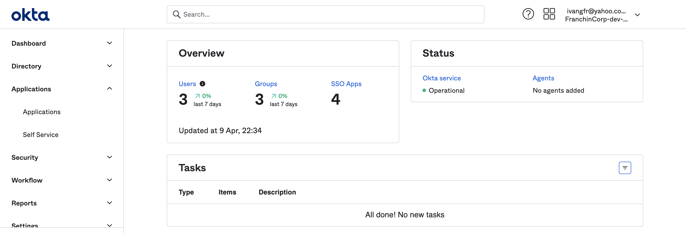

# okta-springboot

The goal of this project is to create a simple [Spring Boot](https://docs.spring.io/spring-boot/docs/current/reference/htmlsingle/) REST API application, called `simple-service`, and secure it with [`Okta`](https://www.okta.com/).

> **Note:** In the repository [`okta-springboot-react`](https://github.com/ivangfr/okta-springboot-react) you can find a more complex example that involves:
> - Implementation of a [`ReactJS`](https://reactjs.org/) front-end application and a `Spring Boot` back-end application, both secured by `Okta`;
> - Enabling and creating `Okta` groups (a.k.a. `ROLES` of the applications).

## Application

- ### simple-service

  `Spring Boot` Web Java application that exposes the following endpoints:
  - `GET /public`: it's a not secured endpoint, everybody can access it;
  - `GET /private`: it's a secured endpoint, only accessible by users that provide a `JWT` access token issued by `Okta`;
  - `POST /callback/token`: it's a not secured endpoint, used by `Okta` to return user's `JWT` access token;
  - `GET /actuator/*`: they are not secured endpoint, used to expose operational information about the application.

## Prerequisites

- [`Java 11+`](https://www.oracle.com/java/technologies/downloads/#java11)
- [`Okta` account](https://developer.okta.com/signup/)

## Configure Okta

### Access Developer Edition Account

- If you do not have a Developer Edition Account, you can create one at https://developer.okta.com/signup/
- If you already have, access https://developer.okta.com/login/

### Access Okta Admin Dashboard

If you are in `Okta Developer Dashboard` home page, click `Admin` button on the top-right


The picture below is how `Okta Admin Dashboard` looks like



### Add Application

- In the `Okta Admin Dashboard` main menu on the left, click `Applications` menu and then `Applications` sub-menu
- In the next page, click `Create App Integration` button
- Select `OIDC - OpenID Connect` as _Sign on method_ and `Web Application` as _Application type_. Click `Next` button
- Enter the following values in the form
  - General Settings
    - App integration name: `Simple Service`
    - Grant type: besides `Authorization Code` that is already checked, check also `Implicit (hybrid)`
    - Sign-in redirect URIs: `http://localhost:8080/login/oauth2/code/okta` and `http://localhost:8080/callback/token`
    - Sign-out redirect URIs: `http://localhost:8080`
  - Assignments
    - Controlled access: `Skip group assignment for now`
- Click `Save` button
- On the next screen, the `Client ID`, `Client Secret`, and `Okta Domain` of `Simple Service` are displayed. For this example, we will need `Client ID` and `Okta Domain`
  
### Add Person

- In the `Okta Admin Dashboard` main menu on the left, click `Directory` menu and then `People` sub-menu
- In the next page, click `Add person` button
- Enter the following information
  - First name: `Mario`
  - Last name: `Bros`
  - Username: `mario.bros@test.com`
  - Primary email: `mario.bros@test.com`
  - Password: `Set by admin`
  - Set a strong password in the text-field that will appear
  - `Uncheck` the check-box that says _"User must change password on first login"_
- Click `Save` button

### Assign Person to Application

- In the `Okta Admin Dashboard` main menu on the left, click `Applications` menu and then `Applications` sub-menu
- In the next page, click `Assign Users to App` button
- Select the `Simple Service` check-box in the _Applications_ column and `Mario Bros` check-box in the _People_ column. Click `Next` button to continue assignment process
- Click `Confirm Assignments` button

### Fix Person username

> **Warning:** if we don't do the fix, we will see the following error
> ```
> Login with OAuth 2.0
> [invalid_token_response] An error occurred while attempting to retrieve the OAuth 2.0 Access Token Response: 400 Bad Request: [{"error":"server_error","error_description":"The 'sub' system claim could not be evaluated."}]
>```
- In the `Okta Admin Dashboard` main menu on the left, click `Applications` menu and then `Applications` sub-menu
- In Applications list whose status are `ACTIVE`, select `Simple Service` application
- Click `Assignments` tab
- Edit `Mario Bros` by clicking the `pen` icon
- Set `mario.bros@test.com` in the `User Name` text-field
- Click `Save` button

## Start application

- Open a terminal and make sure you are in `okta-springboot` root folder

- Export the following environment variables. Those values were obtained while [adding Application](#add-application).
  ```
  export OKTA_DOMAIN=...
  ```

- ### Running application using Maven

  ```
  ./mvnw clean spring-boot:run --projects simple-service
  ```

- ### Running application as a Docker container

  - **Build Docker Image**
    
    - JVM
      ```
      ./docker-build.sh
      ```
    - Native
      ```
      ./docker-build.sh native
      ```

  - **Environment Variables**
    
    | Environment Variable | Description                          |
    |----------------------|--------------------------------------|
    | `OKTA_DOMAIN`        | Specify the `Domain` defined by Okta |

  - **Start Docker Container**
    
    ```
    docker run --rm --name simple-service -p 8080:8080 -e OKTA_DOMAIN=${OKTA_DOMAIN} ivanfranchin/simple-service:1.0.0
    ```

## Getting Access Token

In order to access the `simple-service` secured endpoints, you must have a `JWT` access token. Below are the steps to get it.

- In a terminal, create the following environment variables. Those values were obtained while [adding Application](#add-application)
  ```
  OKTA_CLIENT_ID=...
  OKTA_DOMAIN=...
  ```

- Get Okta Access Token Url
  ```
  OKTA_ACCESS_TOKEN_URL="https://${OKTA_DOMAIN}/oauth2/default/v1/authorize?\
  client_id=${OKTA_CLIENT_ID}\
  &redirect_uri=http://localhost:8080/callback/token\
  &scope=openid\
  &response_type=token\
  &response_mode=form_post\
  &state=state\
  &nonce=6jtp65rt9jf"

  echo $OKTA_ACCESS_TOKEN_URL
  ```

- Copy the Okta Access Token Url from the previous step and paste it in a browser

- The Okta login page will appear. Enter the username & password of the person added at the step [`Configuring Okta > Add person`](#add-person) and click `Sign In` button

- It will redirect to `callback/token` endpoint of `simple-service` and the `Access token` will be displayed, together with other information
  ```
  {
    "state": "state",
    "access_token": "eyJraWQiOiJyNFdY...",
    "token_type": "Bearer",
    "expires_in": "3600",
    "scope": "openid"
  }
  ```
  > **Tip:** In [jwt.io](https://jwt.io), you can decode and verify the `JWT` access token

## Calling simple-service endpoints using curl

- **`GET /public`**

  The `/public` endpoint is not secured, so we can call it without any problem.
  ```
  curl -i http://localhost:8080/public
  ```
  It should return
  ```
  HTTP/1.1 200
  It is public.
  ```

- **`GET /private` without Access Token**

  Try to call `/private` endpoint without informing the access token.
  ```
  curl -i http://localhost:8080/private
  ```
  It should return
  ```
  HTTP/1.1 401
  ```

- **`GET /private` with Access Token**

  First, get the access token as explained in [`Getting Access Token`](#getting-access-token) section. Then, create an environment variable for the access token
  ```
  ACCESS_TOKEN=...
  ```

  Call `/private` endpoint informing the access token.
  ```
  curl -i http://localhost:8080/private -H "Authorization: Bearer $ACCESS_TOKEN"
  ```
  Response
  ```
  HTTP/1.1 200
  mario.bros@test.com, it is private.
  ```

## Using simple-service Swagger

- Access http://localhost:8080/swagger-ui.html

- Get the access token as explained in [`Getting Access Token`](#getting-access-token) section.

- Click `Authorize` button. Paste the access token in the `Value` field. Then, click `Authorize` and `Close` to finalize.

- Done! You can now access the sensitive endpoints.

## Shutdown

Go to the terminal where the application is running and press `Ctrl+C`

## Running Test Cases

- In a terminal, make sure you are inside `okta-springboot` root folder

- Run the command below to start the **Unit Tests**
  ```
  export OKTA_DOMAIN=okta.okta.com
  ./mvnw clean test --projects simple-service
  ```

## Cleanup

### Docker image

To remove the Docker images created by this project, go to terminal and, inside `okta-springboot` root folder, run the following script
```
./remove-docker-images.sh
```

### Okta Configuration

#### Delete Person

- In the `Okta Admin Dashboard` main menu on the left, click `Directory` menu and then `People` sub-menu
- Click `Mario Bros` in the People list
- In `Mario Bros` profile, click `More Actions` multi-button and then `Deactivate`
- Confirm deactivation by clicking `Deactivate` button
- Still in `Mario Bros` profile, click `Delete` button
- Confirm deletion by clicking `Delete` button

#### Delete Application

- In the `Okta Admin Dashboard` main menu on the left, click `Applications` menu and then `Applications` sub-menu
- In Application list whose status is `ACTIVE`, click `Simple Service`'s `gear` icon and then click `Deactivate`
- Confirm deactivation by clicking `Deactivate Application` button
- In Application list whose status is `INACTIVE`, click `Simple Service`'s `gear` icon and then click `Delete`
- Confirm deletion by clicking `Delete Application` button

## Issues

`TestPropertySource` annotation not working! Before starting the tests in a terminal the environment variable OKTA_DOMAIN must be set. See issue [#1577](https://github.com/spring-projects-experimental/spring-native/issues/1577)
