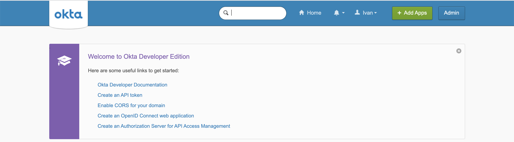

# okta-springboot

The goal of this project is to create a simple [Spring Boot](https://docs.spring.io/spring-boot/docs/current/reference/htmlsingle/) REST API application, called `simple-service`, that uses [`Okta`](https://www.okta.com/) to handle authentication.

> **Note:** In the repository [`okta-springboot-react`](https://github.com/ivangfr/okta-springboot-react) you can find a more complex example that involves:
> - implementation of a [`ReactJS`](https://reactjs.org/) front-end application and a `Spring Boot` back-end application, both secured by `Okta`
> - enabling and creating `Okta` groups (a.k.a `ROLES` of the applications)

## Application

- ### simple-service

  `Spring Boot` Web Java application that exposes two endpoints:
  - `/api/public`: endpoint that can be access by anyone, it is not secured
  - `/api/private`: endpoint that can just be accessed by users registered in `Okta`

## Prerequisites

- [`Java 11+`](https://www.oracle.com/java/technologies/javase-jdk11-downloads.html)
- [`Okta` account](https://developer.okta.com/signup/)

## Configure Okta

### Access Developer Edition Account

- If you do not already have a Developer Edition Account, you can create one at https://developer.okta.com/signup/
- If you already have, access https://developer.okta.com/login/

### Access Okta Admin Dashboard

If you are in `Okta Developer Dashboard` home page, click `Admin` button on the top-right



The picture below is how `Okta Admin Dashboard` looks like


### Add Application

- In `Okta Admin Dashboard` main menu on the left, click `Applications` menu and then `Applications` sub-menu
- On the next page, click `Add Application` button
- Then, click `Create New App` button
- Select `Web` as _Platform_, `OpenID Connect` as _Sign on method_, and click `Create` button
- Enter the following values in the form and, once it's done, click `Save` button
  - Application name: `Simple Service`
  - Login redirect URIs: `http://localhost:8080/login/oauth2/code/okta`
  - Logout redirect URIs: `http://localhost:8080`
- On the next screen, it's shown the 3 important values you will need to configure and run the `Simple Service`: `Client ID`, `Client Secret` and `Okta Domain`
  
### Add Person

- In `Okta Admin Dashboard` main menu on the left, click `Directory` menu and then `People` sub-menu
- On the next page, click `Add person` button
- Enter the following information
  - First name: `Mario`
  - Last name: `Bros`
  - Username: `mario.bros@test.com`
  - Primary email: `mario.bros@test.com`
  - Password: `Set by admin`
    (Set a strong password in the text-field that will appear)
  - `Uncheck` the check-box that says _"User must change password on first login"_
- To finish, click `Save` button

### Assign Person to Application

- In `Okta Admin Dashboard` main menu on the left, click `Applications` menu and then `Applications` sub-menu
- On the next page, click `Assign Users to App` button
- Then, select the `Simple Service` on the _Applications_ column and `Mario Bros` on the _People_ column. Click `Next` button to continue assignment process
- To finish, click `Confirm Assignments` button

### Fix Person username

> **Warning:** if we don't do the fix, we will see the following error
> ```
> Login with OAuth 2.0
> [invalid_token_response] An error occurred while attempting to retrieve the OAuth 2.0 Access Token Response: 400 Bad Request: [{"error":"server_error","error_description":"The 'sub' system claim could not be evaluated."}]
>```

- In `Okta Admin Dashboard` main menu on the left, click `Applications` menu and then `Applications` sub-menu
- In Applications list whose status are `ACTIVE`, select `Simple Service` application
- Click `Assignments` tab
- Edit `Mario Bros` by clicking on the `pen` icon
- In the `User Name` text-field set `Mario Bros`
- To finish, click `Save` button

## Start application

- Open a terminal and make sure you are in `okta-springboot` root folder

- Export the following environment variables. Those values were obtained while (adding Application)[#add-application].
  ```
  export OKTA_CLIENT_ID=...
  export OKTA_CLIENT_SECRET=...
  export OKTA_DOMAIN=...
  ```

- ### Running application using Maven

  ```
  ./mvnw clean spring-boot:run --projects simple-service
  ```

- ### Running application as a Docker container

  - **Build Docker Image**
    
    - JVM
      ```
      ./docker-build.sh
      ```
    - Native (it's not implemented yet)
      ```
      ./docker-build.sh native
      ```

  - **Environment Variables**
    
    | Environment Variable | Description                                 |
    | -------------------- | ------------------------------------------- |
    | `OKTA_CLIENT_ID`     | Specify the `Client ID` defined by Okta     |
    | `OKTA_CLIENT_SECRET` | Specify the `Client Secret` defined by Okta |
    | `OKTA_DOMAIN`        | Specify the `Domain` defined by Okta        |

  - **Start Docker Container**
    
    ```
    docker run -d --rm --name simple-service -p 8080:8080 \
      --env OKTA_CLIENT_ID=${OKTA_CLIENT_ID} \
      --env OKTA_CLIENT_SECRET=${OKTA_CLIENT_SECRET} \
      --env OKTA_DOMAIN=${OKTA_DOMAIN} \
      docker.mycompany.com/simple-service:1.0.0
    ```

## Testing endpoints

- Test `/public` endpoint
  - In a browser and access http://localhost:8080/public
  - It should return `It is public.`

- Test `/private` endpoint
  - In a browser and access http://localhost:8080/private
  - It should redirect you to `Okta` login page
  - Enter `Mario Bros` username (`mario.bros@test.com`) and password
  - It should return `Mario Bros, it is private.`

## Shutdown Application

- If it was started with `Maven`, go to the terminal where it is running and press `Ctrl+C`
- If it was started as a Docker container, run the following command in a terminal
  ```
  docker stop simple-service
  ```

## Okta Clean Up

### Delete Person

- In `Okta Admin Dashboard` main menu on the left, click `Directory` menu and then `People` sub-menu
- Click `Mario Bros` in the People list
- In `Mario Bros` profile, click `More Actions` multi-button and then `Deactivate`
- Confirm deactivation by clicking on `Deactivate` button
- To finish, still in `Mario Bros` profile, click `Delete` button
- Confirm deletion by clicking on `Delete` button

### Delete Application

- In `Okta Admin Dashboard` main menu on the left, click `Applications` menu and then `Applications` sub-menu
- In Application list whose status is `ACTIVE`, click `Simple Service`'s `gear` icon and then click `Deactivate`
- Confirm deactivation by clicking on `Deactivate Application` button
- In Application list whose status is `INACTIVE`, click `Simple Service`'s `gear` icon and then click `Delete`
- Confirm deletion by clicking on `Delete Application` button
