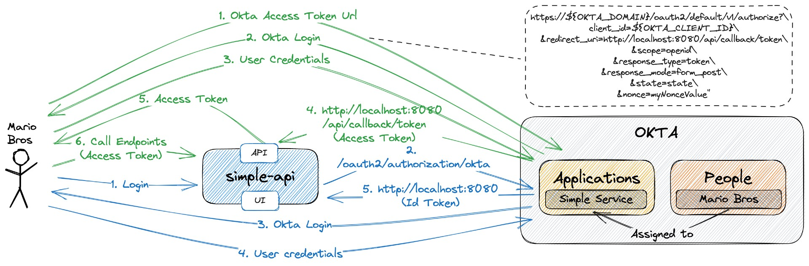

# okta-springboot

The objective of this project is to develop a secure `simple-service` application using [Spring Boot](https://docs.spring.io/spring-boot/index.html) and integrate it with [`Okta`](https://www.okta.com/) for authentication and authorization.

> **Note**: In the repository [`okta-springboot-react`](https://github.com/ivangfr/okta-springboot-react) you can find a more complex example that involves:
> - Implementation of a [`ReactJS`](https://reactjs.org/) front-end application and a `Spring Boot` back-end application, both secured by `Okta`;
> - Enabling and creating `Okta` groups (a.k.a. `ROLES` of the applications).

**Important**: Since Okta removed the Developer Edition Account, this project will no longer be updated.

## Proof-of-Concepts & Articles

On [ivangfr.github.io](https://ivangfr.github.io), I have compiled my Proof-of-Concepts (PoCs) and articles. You can easily search for the technology you are interested in by using the filter. Who knows, perhaps I have already implemented a PoC or written an article about what you are looking for.

## Additional Readings

- \[**Medium**\] [**Implementing and Securing a Simple Spring Boot REST API with Okta**](https://medium.com/@ivangfr/implementing-and-securing-a-simple-spring-boot-rest-api-with-okta-a5143696cd60)
- \[**Medium**\] [**Implementing and Securing a Simple Spring Boot UI (Thymeleaf + RBAC) with Okta**](https://medium.com/@ivangfr/implementing-and-securing-a-simple-spring-boot-ui-thymeleaf-rbac-with-okta-9489cbbcec25)
- \[**Medium**\] [**Implementing and Securing a Spring Boot GraphQL API with Okta**](https://medium.com/@ivangfr/implementing-and-securing-a-spring-boot-graphql-api-with-okta-78bc997359b4)
- \[**Medium**\] [**Building a Single Spring Boot App with Keycloak or Okta as IdP: Introduction**](https://medium.com/@ivangfr/building-a-single-spring-boot-app-with-keycloak-or-okta-as-idp-introduction-2814a4829aed)

## Project Diagram



## Application

- ### simple-service

  `Spring Boot` Web Java application offers a user interface (UI) that requires users to log in using their `Okta` accounts. After successful login, users can access and view both their public and private messages.

  | Login                                    | Index                                    |
  |------------------------------------------|------------------------------------------|
  |  |  |

  It also exposes the following endpoints:

  | Endpoint                   | Description                                                                                          | Secured |
  |----------------------------|------------------------------------------------------------------------------------------------------|---------|
  | `GET /api/private`         | Retrieve the private message. Only accessible by users that provide an Access Token issued by `Okta` | YES     |
  | `GET /api/public`          | Retrieve the public message                                                                          | NO      |
  | `POST /api/callback/token` | Used by `Okta` to return user's Access Token                                                         | NO      |

## Prerequisites

- [`Java 21`](https://www.oracle.com/java/technologies/downloads/#java21) or higher;
- [`Okta` account](https://developer.okta.com/signup/)
- A containerization tool (e.g., [`Docker`](https://www.docker.com), [`Podman`](https://podman.io), etc.)

## Configure Okta

### Access Developer Edition Account

- If you do not have a Developer Edition Account, you can create one at https://developer.okta.com/signup/
- If you already have, access https://developer.okta.com/login/

### Access Okta Admin Dashboard

If you are in `Okta Developer Dashboard` home page, click `Admin` button on the top-right.


The picture below is how `Okta Admin Dashboard` looks like:


### Add Application

- In the `Okta Admin Dashboard` main menu on the left, click `Applications` menu and then `Applications` sub-menu.
- In the next page, click `Create App Integration` button.
- Select `OIDC - OpenID Connect` as _Sign on method_ and `Web Application` as _Application type_. Click `Next` button.
- Enter the following values in the form:
  - General Settings
    - App integration name: `Simple Service`
    - Grant type: besides `Authorization Code` that is already checked, check also `Implicit (hybrid)`
    - Sign-in redirect URIs: `http://localhost:8080/login/oauth2/code/okta` and `http://localhost:8080/api/callback/token`
    - Sign-out redirect URIs: `http://localhost:8080`
  - Assignments
    - Controlled access: `Skip group assignment for now`
- Click `Save` button.
- The `Client ID` and `Client Secret` are generated.
- The `Okta Domain` can be obtained by clicking the button-menu present on the up-right corner of the screen.
  
### Add Person

- In the `Okta Admin Dashboard` main menu on the left, click `Directory` menu and then `People` sub-menu.
- In the next page, click `Add person` button.
- Enter the following information:
  - First name: `Mario`
  - Last name: `Bros`
  - Username: `mario.bros@test.com`
  - Primary email: `mario.bros@test.com`
  - Password: `Set by admin`
  - Set a strong password in the text-field that will appear.
  - `Uncheck` the check-box that says _"User must change password on first login"_.
- Click `Save` button.

### Assign Person to Application

- In the `Okta Admin Dashboard` main menu on the left, click `Applications` menu and then `Applications` sub-menu.
- In the next page, click `Assign Users to App` button.
- Select the `Simple Service` check-box in the _Applications_ column and `Mario Bros` check-box in the _People_ column. Click `Next` button to continue assignment process.
- Click `Confirm Assignments` button.

### Fix Person username

> **Warning**: if we don't do the fix, we will see the following error
> ```json
> {"state":"state","error":"server_error","error_description":"The 'sub' system claim could not be evaluated."}
>```
- In the `Okta Admin Dashboard` main menu on the left, click `Applications` menu and then `Applications` sub-menu.
- In Applications list whose status are `ACTIVE`, select `Simple Service` application.
- Click `Assignments` tab.
- Edit `Mario Bros` by clicking the `pen` icon.
- Set `mario.bros@test.com` in the `Username` text-field.
- Click `Save` button.

## Start application

- Open a terminal and make sure you are in `okta-springboot` root folder.

- Export the following environment variables. Those values were obtained while [adding application](#add-application) in `Okta`.
  ```bash
  export OKTA_DOMAIN=...
  export OKTA_CLIENT_ID=...
  export OKTA_CLIENT_SECRET=...
  ```

- ### Running application using Maven

  ```bash
  ./mvnw clean spring-boot:run --projects simple-service
  ```

- ### Running application as a Docker container

  - **Build Docker Image**
    ```bash
    ./build-docker-images.sh
    ```

   **Environment Variables**
    
    | Environment Variable | Description                                 |
    |----------------------|---------------------------------------------|
    | `OKTA_DOMAIN`        | Specify the `Domain` defined by Okta        |
    | `OKTA_CLIENT_ID`     | Specify the `Client ID` defined by Okta     |
    | `OKTA_CLIENT_SECRET` | Specify the `Client Secret` defined by Okta |

  - **Start Docker Container**
    
    ```bash
    docker run --rm --name simple-service -p 8080:8080 \
    -e OKTA_DOMAIN=${OKTA_DOMAIN} \
    -e OKTA_CLIENT_ID=${OKTA_CLIENT_ID} \
    -e OKTA_CLIENT_SECRET=${OKTA_CLIENT_SECRET} \
    ivanfranchin/simple-service:1.0.0
    ```
## Application URLs

| Application    | Type    | URL                                   |
|----------------|---------|---------------------------------------|
| simple-service | UI      | http://localhost:8080                 |
| simple-service | Swagger | http://localhost:8080/swagger-ui.html |

## Getting Access Token

In order to access the `simple-service` secured endpoints, you must have an Access Token. Below are the steps to get it.

- In a terminal, create the following environment variables. Those values were obtained while [adding application](#add-application) in `Okta`:
  ```bash
  OKTA_DOMAIN=...
  OKTA_CLIENT_ID=...
  ```

- Get Okta Access Token Url:
  ```bash
  OKTA_ACCESS_TOKEN_URL="https://${OKTA_DOMAIN}/oauth2/default/v1/authorize?\
  client_id=${OKTA_CLIENT_ID}\
  &redirect_uri=http://localhost:8080/api/callback/token\
  &scope=openid\
  &response_type=token\
  &response_mode=form_post\
  &state=state\
  &nonce=myNonceValue"

  echo $OKTA_ACCESS_TOKEN_URL
  ```

- Copy the Okta Access Token Url from the previous step and paste it in a browser.

- The Okta login page will appear. Enter the username & password of the person added at the step [`Configuring Okta > Add person`](#add-person) and click `Sign In` button.

- It will redirect to `api/callback/token` endpoint of `simple-service` and the `Access token` will be displayed, together with other information:
  ```json
  {
    "state": "state",
    "access_token": "eyJraWQiOiJyNFdY...",
    "token_type": "Bearer",
    "expires_in": "3600",
    "scope": "openid"
  }
  ```
  > **Note**: In [jwt.io](https://jwt.io), you can decode and verify the Access Token

## Calling simple-service endpoints using curl

- **`GET api/public`**

  The `api/public` endpoint is not secured, so we can call it without any problem:
  ```bash
  curl -i http://localhost:8080/api/public
  ```
  It should return:
  ```bash
  HTTP/1.1 200
  It's a public message.
  ```

- **`GET api/private` without Access Token**

  Try to call the `api/private` endpoint without informing the Access Token:
  ```bash
  curl -i http://localhost:8080/api/private
  ```
  It should return:
  ```bash
  HTTP/1.1 401
  ```

- **`GET api/private` with Access Token**

  First, get the access token as explained in [`Getting Access Token`](#getting-access-token) section. Then, create an environment variable for the access token:
  ```bash
  ACCESS_TOKEN=...
  ```

  Call the `api/private` endpoint informing the access token:
  ```bash
  curl -i http://localhost:8080/api/private -H "Authorization: Bearer $ACCESS_TOKEN"
  ```
  Response
  ```bash
  HTTP/1.1 200
  mario.bros@test.com, it's a private message.
  ```

## Using simple-service Swagger

- Access http://localhost:8080/swagger-ui.html.
- Get the access token as explained in [`Getting Access Token`](#getting-access-token) section.
- Click the `Authorize` button. Paste the Access Token in the `Value` field. Then, click `Authorize` and `Close` to finish.
- Done! You can now access the sensitive endpoints.

## Shutdown

Go to the terminal where the application is running and press `Ctrl+C`.

## Running Test Cases

In a terminal and inside `okta-springboot` root folder, run the command below:
```bash
./mvnw clean test --projects simple-service
```

## Cleanup

### Docker image

To remove the Docker images created by this project, go to terminal and, inside `okta-springboot` root folder, run the following script:
```bash
./remove-docker-images.sh
```

### Okta Configuration

#### Delete Person

- In the `Okta Admin Dashboard` main menu on the left, click `Directory` menu and then `People` sub-menu.
- Click `Mario Bros` in the People list.
- In `Mario Bros` profile, click `More Actions` multi-button and then `Deactivate`.
- Confirm deactivation by clicking `Deactivate` button.
- Still in `Mario Bros` profile, click `Delete` button.
- Confirm deletion by clicking `Delete` button.

#### Delete Application

- In the `Okta Admin Dashboard` main menu on the left, click `Applications` menu and then `Applications` sub-menu.
- In Application list whose status is `ACTIVE`, click the `gear` icon for `Simple Service` and then click `Deactivate`.
- Confirm deactivation by clicking `Deactivate Application` button.
- In Application list whose status is `INACTIVE`, click the `gear` icon for `Simple Service` and then click `Delete`.
- Confirm deletion by clicking `Delete Application` button.
